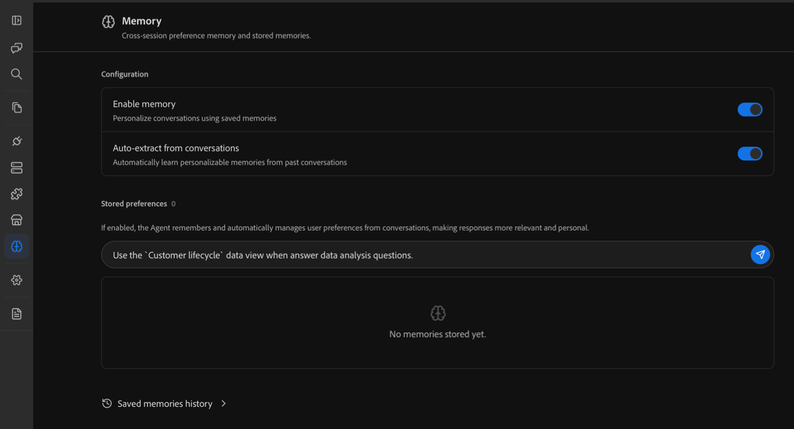

# Analizar datos de Customer Journey Analytics con el chat de Coworker

>[!AVAILABILITY]
>
>La funcionalidad descrita en este artículo se encuentra en la fase de prueba limitada de la versión y es posible que aún no esté disponible en su entorno. Esta nota se eliminará cuando la funcionalidad esté disponible de forma general. Para obtener información sobre el proceso de lanzamiento de Customer Journey Analytics, consulte [lanzamientos de características de Customer Journey Analytics](https://experienceleague.adobe.com/es/docs/analytics-platform/using/releases/latest).

Adobe CX Enterprise Coworker Chat puede realizar análisis de datos avanzados que anteriormente solo eran posibles en Analysis Workspace. El chat de compañeros accede a los datos de sus vistas de datos de Customer Journey Analytics, lo que le permite explorar esos datos y obtener respuestas a las preguntas en lenguaje natural.

Antes de comenzar el análisis, obtenga información acerca de la interfaz y las opciones de configuración de Coworker Chat y, a continuación, asegúrese de que Coworker esté conectado a Customer Journey Analytics y a la vista de datos que contiene los datos que desea utilizar.

## Introducción al chat con compañeros

### Opciones de interfaz y configuración

Antes de usar el chat de Coworker con los datos de Customer Journey Analytics, aprenda a iniciar sesión y administrar las opciones de configuración de las siguientes funciones:

* Entradas de chat

* Conversaciones

* Marketplaces

* Servidores MCP

* Memoria

* Complementos

* Aptitudes

* Y más

Para obtener más información, consulte la [Guía de la interfaz de usuario de Coworker Chat](https://experienceleague.adobe.com/es/docs/cx-enterprise-coworker/content/chat/ui-guide).

### Casos de uso para Customer Journey Analytics

Puede ver casos de uso de Customer Journey Analytics y ejemplos de mensajes que los profesionales utilizan en Adobe CX Enterprise Coworker Chat. Cada mensaje se crea para copiarse, adaptarse con sus propios datos y contexto, y refinarse a través de la conversación.

Para obtener más información, consulte [Casos de uso](https://experienceleague.adobe.com/es/docs/cx-enterprise-coworker/content/chat/use-cases).

## Compruebe que Chat del compañero está conectado a Customer Journey Analytics

1. En Coworker Chat, compruebe que Coworker esté conectado a Customer Journey Analytics:

1. Seleccione el icono de MCP en el carril izquierdo y, a continuación, asegúrese de que [!UICONTROL **cja-mcp**] está disponible en su lista de servidores MCP conectados.

   

1. (Condicional) Si [!UICONTROL **cja-mcp**] aún no está conectado, seleccione [!UICONTROL **Agregar servidor MCP**], especifique cja en el campo [!UICONTROL **Nombre de servidor**] y selecciónelo cuando aparezca, luego seleccione [!UICONTROL **Agregar servidor**].

## Conéctese a la vista de datos correcta

Una vista de datos es un contenedor de Customer Journey Analytics que determina cómo se interpretan los datos.

Es posible que tenga acceso a varias vistas de datos en Customer Journey Analytics, cada una de las cuales contiene diferentes dimensiones y métricas que el colaborador puede utilizar al analizar los datos.

### Decida qué vistas de datos desea utilizar

Indique a su Compañero de trabajo los tipos de preguntas que desea responder y pregúntele a qué vistas de datos tiene acceso que sería mejor para proporcionar esa información. También puede [establecer su vista de datos como una preferencia en la memoria](#add-a-data-view-preference-in-memory).

**Usted:**

>[!BEGINSHADEBOX]

Me interesa saber dónde caen los clientes en el recorrido de clientes. ¿A qué vistas de datos de Customer Journey Analytics tengo acceso que puedan responder a esta pregunta?

>[!ENDSHADEBOX]

**Respuesta de chat de compañero:**

>[!BEGINSHADEBOX]

Tiene acceso a tres vistas de datos. La vista de datos `Customer lifecycle` contiene las siguientes dimensiones y métricas, que serían las mejores para responder a su pregunta.

>[!ENDSHADEBOX]

**Usted:**

>[!BEGINSHADEBOX]

Genial, vamos a usar esa vista de datos.

>[!ENDSHADEBOX]

**Respuesta de chat de compañero:**

>[!BEGINSHADEBOX]

De acuerdo, usaré la vista de datos de `Customer lifecycle` para responder preguntas futuras en esta sesión de chat.

>[!ENDSHADEBOX]

### Agregar una preferencia de vista de datos en la memoria

El Chat de Coworker contiene una función de memoria que le permite proporcionarle acceso a la información que abarca todos los chats. Se recomienda añadir las vistas de datos preferidas como preferencias en la memoria del colaborador.

1. En Chat del compañero, en la barra de navegación izquierda, seleccione el icono Memoria.

1. En la página Memoria, en la sección Preferencias almacenadas, especifique una o varias vistas de datos que quiera que Chat del compañero use en sus conversaciones.

   

## Analizar en Customer Journey Analytics

Una vez que su compañero haya creado una visualización, podrá abrirla en Analysis Workspace en Customer Journey Analytics para realizar un análisis más profundo con un control más granular. La visualización se abre en un nuevo proyecto de Analysis Workspace en Customer Journey Analytics.

Para abrir una visualización en un nuevo proyecto de Analysis Workspace:

1. Seleccione [!UICONTROL **Analizar en CJA**] junto a cualquier visualización que se cree en Coworker.

1. Con la visualización abierta en Customer Journey Analytics, puede utilizar la interfaz del explorador de arrastrar y soltar de Analysis Workspace para realizar modificaciones, desarrollar aún más el análisis, crear una audiencia y mucho más. Incluso puede compartir su proyecto de Workspace con quien desee.

   Para obtener más información sobre Analysis Workspace, consulte [Información general de Analysis Workspace](https://experienceleague.adobe.com/es/docs/analytics-platform/using/cja-workspace/home).

## Ejemplo: Encuentre el lugar de entrega de los clientes

Puede pedirle a Coworker Chat que use sus datos para analizar cualquier pregunta comercial.

Por ejemplo, como administrador de marketing, comerciante o líder de crecimiento, es posible que desee comprender dónde abandonan los clientes la ruta de compra, por qué lo hicieron y qué se puede hacer para aumentar las tasas de conversión.

>[!NOTE]
>
>Las figuras siguientes son datos de ejemplo ilustrativos de un retailer ficticio, [!DNL TechPulse Electronics], que se usa para mostrar la forma de la conversación.

### Los tipos de preguntas que puede hacer

No necesita saber qué es una &quot;visualización de abandonos&quot; o qué métrica se incluye en qué ranura. En su lugar, describa el resultado que le interesa en lenguaje sencillo:

* &quot;¿Dónde estamos perdiendo gente en el camino a comprar?&quot;
* &quot;¿Cuál es mi funnel de conversión completo, de vista de producto a cierre de compra?&quot;
* &quot;¿Qué canales de marketing pierden más entre el carro de compras y la compra?&quot;
* &quot;¿El abandono del carro de compras es peor en móviles o equipos de escritorio?&quot;
* &quot;¿La gente de las redes sociales pagadas se convierte de forma diferente que la gente del correo electrónico?&quot;

### La conversación

#### &#x200B;1. Comience con la pregunta empresarial

**Usted:**

>[!BEGINSHADEBOX]

¿Dónde estamos perdiendo gente en el camino a comprar?

>[!ENDSHADEBOX]

**Respuesta de chat de compañero:**

Tenga en cuenta que Coworker Chat elige la visualización correcta, secuencia los puntos de contacto e incluso añade los pasos siguientes recomendados.

>[!BEGINSHADEBOX]

Esta es una pregunta de funnel. Permítanme ejecutar funnel de conversión para ver dónde se producen los descensos en la ruta de compra.

Aquí es donde estás perdiendo gente:

| Paso de funnel | Count | Conversión a siguiente | Entrega |
| --- | --- | --- | --- |
| Sessions | 137,476 | 45,0% ve un producto | El 55% se va sin explorar los productos |
| Vistas del producto | 61,845 | 55,0 % añadir al carrito | 45% de exploración, pero no agregar |
| El carro agrega | 34,045 | 16,4% de compra | 83,6 % abandonan el carro |
| Compras | 5,582 | — | — |

**El gran hallazgo: el carro de compras es tu mayor fuga**

28.463 personas agregan artículos al carro de compras, pero nunca completan la compra. Esto representa una tasa de entrega del 83,6% del carro de compras, que es, con mucho, el mayor punto de fallo.

Para ponerlo en términos de dólares, convertir solo un 10% más de esas adiciones al carro de compras agregaría unas 2,846 compras. A la escala de datos actual, eso es un ingreso potencialmente significativo que queda sobre la mesa.

**Lo que esto le dice sobre las prioridades:**

| Prioridad | Problema | Escala de oportunidad |
| --- | --- | --- |
| #1 | Abandono del carro de compras (caída del 83,6 %) | 28.463 compradores perdidos |
| #2 | Sesión a vista de producto (55 % no examinar nunca) | 75.631 sesiones sin participación del producto |
| #3 | Vista del producto al carro de compras (el 45 % no agrega) | 27.800 interesados pero no comprometidos |

**Pasos siguientes recomendados:**

1. Desglose el abandono del carro de compras por canal de marketing: ¿ciertos canales aportan tráfico de baja intención que se añade al carro de compras, pero nunca se compra?
1. Observen el abandono del carro de compras por tipo de dispositivo: ¿la fricción del cierre de compra móvil mata las conversiones?
1. Identificar qué productos se abandonan más: ¿problema de precios? ¿Sorpresa de envío?

**¿Cuál de ellos desea que investigue a continuación?** El desglose de canal le indicaría directamente qué acciones de marketing le están trayendo &quot;casi compradores&quot; en comparación con los compradores reales.

>[!ENDSHADEBOX]

#### &#x200B;2. Profundizar en la fuga

**Usted:**

>[!BEGINSHADEBOX]

Vale, vamos a desglosar por canal de marketing

>[!ENDSHADEBOX]

**Respuesta de chat de compañero:**

>[!BEGINSHADEBOX]

Hay una dimensión **Canal de mercadotecnia** personalizada. Permítanme extraer el funnel y, a continuación, calcular las tasas de conversión por canal e identificar dónde se filtra cada canal.

**El veredicto: la filtración no es específica del canal**

Este es un hallazgo realmente revelador. Este es el desglose de funnel por canal:

| Canal | Sessions | A la vista de producto | Añadir al carro de compras | Para comprar | Conversión general | Ingresos/sesión |
| --- | --- | --- | --- | --- | --- | --- |
| Búsqueda de pago | 43,958 | 45.1% | 54.6% | 16.6% | 4.09% | $499.58 |
| Búsqueda orgánica | 31,492 | 44.9% | 54.9% | 16.9% | 4.17% | $494.76 |
| Directo | 25,661 | 43.6% | 55.4% | 15.8% | 3.82% | $497.29 |
| Correo electrónico | 17,586 | 45.3% | 55.4% | 16.2% | 4.07% | $501.13 |
| Social de pago | 12,684 | 45.4% | 55.7% | 16.0% | 4.03% | $512.17 |
| Mostrar | 6,511 | 45.3% | 55.7% | 16.2% | 4.09% | $501.45 |

**Extras de claves:**

1. La lista desplegable del carro de compras es errónea de forma uniforme en todos los canales (83-84 %). Esto significa que el problema no se trata de la calidad del tráfico: cada canal ofrece visitantes con un interés similar. La fuga está en su propia experiencia de pago, no en su marketing.
1. Ningún canal es significativamente mejor o peor en la conversión. Las tasas de conversión generales se agrupan estrechamente entre el 3,8 % y el 4,2 %, y los ingresos por sesión son casi idénticos (de 495 a 512 dólares).
1. Donde más importa el impacto del volumen: la búsqueda de pago pierde más personas en términos absolutos (9.015 abandonos del carro de compras), seguida de la búsqueda orgánica (6.449 perdidos). Estas son las mayores oportunidades de valor en dólares porque son las que generan la mayor cantidad de tráfico.

**Lo que esto le dice estratégicamente**

Los canales de mercadotecnia están haciendo su trabajo. Todos están interesando a la gente y agregando al carro de compras a tasas similares. El problema es el flujo descendente del marketing: su pago y flujo de pago es donde el dinero se está filtrando.

**Próximas investigaciones recomendadas:**

1. Desglose el abandono del carro de compras por tipo de dispositivo: ¿el cierre de compra móvil está roto o es frustrante?
1. Mira qué productos son los más abandonados, ¿hay una sorpresa de precios o envío en el pago?
1. Compruebe si la campaña &quot;holiday_flash_sale&quot; tuvo una mejor conversión de cierre de compra; las campañas impulsadas por la urgencia podrían superar la fricción de cierre de compra

**¿Qué ángulo desea explorar a continuación?**

>[!ENDSHADEBOX]

#### &#x200B;3. Sigue investigando

**Usted:**

>[!BEGINSHADEBOX]

Interesante. Intentemos desglosar por tipo de dispositivo.

>[!ENDSHADEBOX]

**Respuesta de chat de compañero:**

>[!BEGINSHADEBOX]

**Lo encontró: el cierre de compra móvil está roto**

El funnel es idéntico en todos los dispositivos hasta el cierre de compra, luego el móvil se cae por un precipicio:

| Device | Sessions | A la vista de producto | Añadir al carro de compras | Para comprar | Conversión general |
| --- | --- | --- | --- | --- | --- |
| Escritorio | 70,172 | 44.9% | 54.8% | 23.2% | 5.70% |
| Tableta | 14,149 | 44.7% | 55.6% | 14.3% | 3.56% |
| Móvil | 53,449 | 44.9% | 55.3% | 8.1% | 2.02% |

**La pistola humeante**

| Métrica | Escritorio | Móvil | Espacio |
| --- | --- | --- | --- |
| Tasa de carro de compras | 23.2% | 8.1% | 15 puntos porcentuales |
| El móvil es | — | 2,8x peor | — |
| Carros abandonados | 13,274 | 12,178 | Casi el mismo volumen absoluto |

La experiencia de navegación y complementos al carro de compras está bien en dispositivos móviles (idéntica tasa de navegación de ~45%, ~55% tasa de adición al carro de compras). La gente está igualmente interesada y comprometida. Pero algo en el flujo de pago móvil está matando las conversiones.

**La oportunidad de ingresos**

Si el cierre de compra móvil se convirtiera a la misma velocidad que el equipo de escritorio, obtendría ~1.991 compras adicionales, un aumento del 35% en el volumen total de compras al corregir una experiencia.

**Qué es lo más probable**

El patrón de datos (participación igual, caída catastrófica de cierre de compra) es una señal clásica para:

* Fricción del formulario de pago en pantallas pequeñas (problemas de relleno automático, diseño del formulario)
* Costes inesperados revelados en el cierre de compra (envío, impuestos) que causan un shock por pegatinas
* Cierre de compra de invitado no disponible o un muro de inicio de sesión en dispositivos móviles
* Problemas de carga de página o tiempo de espera durante el procesamiento de pagos en dispositivos móviles

**Pasos siguientes recomendados:**

1. Desglose el abandono del carro de compras móvil por categoría de producto: ¿es peor para los artículos de alto precio (lo que sugiere problemas de fideicomiso de pagos móviles)?
1. Observe qué canales de marketing generan la mayor cantidad de tráfico móvil: ¿está gastando dinero de los medios de comunicación para enviar a la gente a un funnel móvil dañado?
1. Compruebe si hay una señal de página o de sección del sitio. ¿Podemos ver qué páginas de cierre de compra visitaron los usuarios móviles los últimos antes de abandonarlas?

**¿Cuál desea explorar o es evidencia suficiente para llevar a su equipo de UX y de pago?**

>[!ENDSHADEBOX]

#### &#x200B;4. Conviértalo en una decisión

**Usted:**

>[!BEGINSHADEBOX]

Entonces, ¿qué debo hacer?

>[!ENDSHADEBOX]

**Respuesta de chat de compañero:**

>[!BEGINSHADEBOX]

Basándome en lo que muestran los datos, aquí es donde me enfocaría:

* **Corrija el cierre de compra móvil; no es un problema de canal.** Cada canal está convirtiendo a las personas en el carro de compras a una tasa similar y saludable, por lo que el gasto en publicidad está funcionando en todos los ámbitos. Los ingresos se pierden específicamente en el flujo de cierre de compra móvil, que es donde pertenece la corrección.
* **Empiece con el pago y la fricción del formulario.** Estas son las razones más comunes por las que los compradores móviles de alta intención abandonan un carro de compras. Ofrecer opciones de billetera móvil y acortar el formulario suelen ser las ganancias más rápidas.
* **Vuelva a comprobar después de la corrección.** Una vez que se envían los cambios de cierre de compra, observe si la tasa de compra del carro de compras del móvil se desplaza hacia la tasa de escritorio del 23,2 %.

¿Quiere que guarde esto como un proyecto para que pueda rastrearlo o que establezca una alerta si el carro de compras móvil cae por debajo de un umbral?

>[!ENDSHADEBOX]

### Lo que acaba de pasar

En cuatro preguntas en lenguaje simple, Coworker nos ayudó:

* Cree un funnel de conversión de varios pasos y marque el carro de compras como la mayor fuga
* Descartar el canal de marketing como causa: todos los canales se filtraron casi al mismo ritmo
* Aísle el problema real del cierre de compra móvil y cuantifique la corrección en un alza del 35 % en las compras
* Salga con una solución específica para priorizar: pago móvil y fricción de formularios. Esto se compara con la tasa de conversión del 23,2% de los equipos de sobremesa

<!--

## Example #2: Find which marketing efforts drive revenue

You can ask Coworker Chat to use your data to analyze any business question.

For example, as a marketing manager, demand generation lead, or CMO, you might want to know which marketing efforts actually deserve credit for revenue so you can confidently decide where to put your marketing spend, rather than rewarding whichever channel happened to get the last click.

>[!NOTE]
>
>The figures below are illustrative sample data for a fictional retailer, [!DNL TechPulse Electronics], used to show the shape of the conversation.

### The types of questions you can ask

You don't need to know what an "attribution model" is, or how to configure an Attribution panel. Instead, describe the outcome you care about in plain language:

* "Which channels actually drive our revenue, not just the last click?"
* "If I change how I give credit for a sale, does my best channel change?"
* "Which campaigns start customer journeys versus close them?"
* "Am I over-investing in paid search because it always gets the last click?"
* "What role does email play in conversions it never gets credit for?"

### The conversation

#### 1. Start with the business question

**You:**

>[!BEGINSHADEBOX]

Which marketing channels actually drive our revenue?

>[!ENDSHADEBOX]

**Coworker Chat response:**

Notice that Coworker Chat picks the right analysis, starts with the model most reports default to, and immediately flags what that model can't tell you.

>[!BEGINSHADEBOX]

This is an attribution question — let me attribute revenue to your marketing channels so you can see who's earning it.

I'll start with **last-touch attribution**, since that's what most out-of-the-box reports show. It gives all the credit for a sale to the last channel a person used before purchasing.

| Marketing channel | Attributed revenue (last touch) | Share |
| --- | --- | --- |
| Paid search | $948,000 | 34% |
| Organic search | $614,000 | 22% |
| Direct | $474,000 | 17% |
| Email | $307,000 | 11% |
| Paid social | $251,000 | 9% |
| Display | $195,000 | 7% |

**The headline: paid search looks like your hero**

Under last touch, paid search earns a third of all revenue — more than any other channel. If this were the only view you had, you'd likely pour more budget into paid search.

**One important caveat before you do that**

Last touch only tells you who *closed* the sale. It says nothing about who *started* the journey or *assisted* along the way. A channel that introduces people to your brand weeks before they buy gets zero credit here, even if the purchase never would've happened without it.

To know whether paid search is really driving revenue — or just harvesting demand other channels created — you need to compare attribution models.

**Recommended next step:**

Compare the same channels across first-touch, last-touch, and linear models. If paid search stays on top across all of them, it's a genuine driver. If it shrinks under first touch, it's a closer, not a creator.

**Want me to run that comparison?**

>[!ENDSHADEBOX]

#### 2. Compare attribution models

**You:**

>[!BEGINSHADEBOX]

Yes, compare it across models.

>[!ENDSHADEBOX]

**Coworker Chat response:**

>[!BEGINSHADEBOX]

Here's each channel's share of revenue under three models. First touch credits the channel that started the journey, last touch credits the one that closed it, and linear splits credit evenly across every touch.

| Marketing channel | First touch | Last touch | Linear |
| --- | --- | --- | --- |
| Paid search | 19% | 34% | 26% |
| Organic search | 20% | 22% | 21% |
| Direct | 9% | 17% | 13% |
| Email | 18% | 11% | 15% |
| Paid social | 21% | 9% | 15% |
| Display | 13% | 7% | 10% |

**The verdict: your "best" channel depends entirely on how you count**

This is the finding that changes budget decisions.

1. **Paid search closes far more than it starts.** It jumps from 19% of first touches to 34% of last touches. That's the signature of a *harvester* — it captures people who are already ready to buy, often after another channel introduced them. Valuable, but it's finishing journeys, not creating them.
1. **Paid social and email are badly undercredited by last touch.** Paid social starts 21% of journeys but gets credit for only 9% of sales. Email starts 18% but closes 11%. These channels are doing the expensive work at the top of the funnel and handing warm prospects to paid search.
1. **Organic search is your steady workhorse.** It sits around 20% across every model — it both starts and closes journeys reliably.

**Why this matters for budget**

If you cut paid social or email based on their weak last-touch numbers, you'd starve the top of your funnel — and paid search would have far fewer ready-to-buy people to close. You'd likely see paid search revenue fall too, even though you didn't touch its budget.

**Recommended next step:**

Look at the campaign level to see exactly which efforts start journeys versus close them. That's where you can act — trimming or protecting specific campaigns rather than whole channels.

**Want me to break this down by campaign?**

>[!ENDSHADEBOX]

#### 3. Keep investigating

**You:**

>[!BEGINSHADEBOX]

Let's break it down by campaign.

>[!ENDSHADEBOX]

**Coworker Chat response:**

>[!BEGINSHADEBOX]

There's a **Campaign Name** dimension. Here are your highest-involvement campaigns, comparing the revenue they start (first touch) against the revenue they close (last touch).

| Campaign | Starts (first touch) | Closes (last touch) | Role |
| --- | --- | --- | --- |
| brand_awareness_q3 | $412,000 | $103,000 | Initiator |
| email_winback | $214,000 | $88,000 | Initiator |
| holiday_flash_sale | $268,000 | $249,000 | All-rounder |
| retargeting_dynamic | $71,000 | $339,000 | Closer |
| branded_search_always_on | $84,000 | $498,000 | Closer / harvester |

**The pattern: some of your "worst" campaigns are actually your best starters**

* **brand_awareness_q3** and **email_winback** start far more revenue than they close. On a last-touch ROI report, these look like underperformers you might cut. In reality, they're filling the top of your funnel — the journeys other campaigns finish.
* **retargeting_dynamic** and **branded_search_always_on** are the opposite. They close a lot but start almost nothing. They're efficient closers, but they can only close demand that already exists. Branded search, in particular, is largely capturing people who were going to search for you by name anyway.
* **holiday_flash_sale** does both — it introduces new shoppers and closes them, which is why urgency-driven promotions often look strong under any model.

**What this tells you strategically**

The campaigns you'd cut first on a last-touch report — the awareness and win-back efforts — are the ones creating the demand your closers depend on. Judge initiators on the journeys they start, and closers on the journeys they finish.

**Recommended next steps:**

1. Protect the initiator campaigns even though their last-touch ROI looks weak — they're feeding the funnel.
1. Right-size the branded search spend — test whether trimming it changes total revenue, since much of that demand may convert anyway.
1. Adopt a balanced model — like linear or a position-based model — as your default reporting view, so no channel gets systematically over- or under-rewarded.

**Want me to save this as a project, or is this enough to take into your budget planning?**

>[!ENDSHADEBOX]

#### 4. Turn it into a decision

**You:**

>[!BEGINSHADEBOX]

So how should I allocate budget?

>[!ENDSHADEBOX]

**Coworker Chat response:**

>[!BEGINSHADEBOX]

Based on what the data shows, here's where I'd focus:

* **Stop judging upper-funnel channels on last touch alone.** Paid social and email start about 20% of your revenue each, but last touch credits them for less than half of that. Protect their budgets — they're creating the demand paid search closes.
* **Treat branded search as a harvester, not a driver.** It closes a lot but starts almost nothing. Test trimming it, since much of that demand may convert through other paths anyway.
* **Make a balanced model your default.** Reporting on linear or a position-based model instead of last touch will stop you from over-rewarding closers and under-funding the channels that start journeys.
* **Re-check after you rebalance.** Watch whether total revenue holds steady as you shift spend toward initiators — that's the signal your funnel is healthier, not just your last-touch report.

Want me to save this as a project so you can track it, or build a calculated metric that reports revenue on a balanced attribution model going forward?

>[!ENDSHADEBOX]

### What just happened

In four plain-language questions, Coworker helped us:

* Attribute revenue to marketing channels and flag that the default last-touch view tells only part of the story
* Compare attribution models and reveal that the "best" channel changes completely depending on how credit is counted
* Discover that paid social and email start far more revenue than they ever get credit for closing
* Identify which campaigns initiate journeys versus close them, and walk away with a budget direction: protect the initiators, right-size the harvesters, and report on a balanced model

-->
