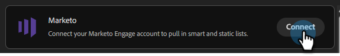
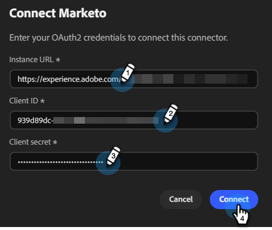
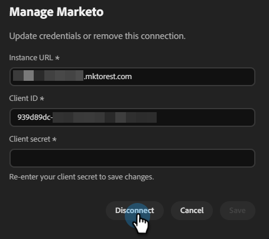

# Conectar con Marketo Engage {#marketo}

Adobe Coworker Campaigns permite conectar su cuenta de Marketo Engage para extraer listas inteligentes y estáticas.

>[!PREREQUISITES]
>
>Para utilizar este conector, primero debe tener:
>
>* Una cuenta activa de Marketo Engage
>* Su **URL de instancia** de Marketo
>* Se ha creado un [servicio personalizado](https://experienceleague.adobe.com/en/docs/marketo-developer/marketo/rest/custom-services#custom-services-1) para las campañas de compañeros en Marketo, con su [ID de cliente y secreto de cliente](https://experienceleague.adobe.com/en/docs/marketo-developer/marketo/rest/authentication#creating-an-access-token) a mano

## Cómo conectar

1. En la página principal de [Campañas de colaboración](https://coworker-campaigns.experience.adobe.com/), haga clic en **Personalizar** y seleccione **Conectores**.

   

1. Haga clic en **Agregar integración**.

   

   >[!NOTE]
   >
   >Si esta no es su primera integración, el botón dirá &quot;Agregar conector&quot;.

1. En la fila Marketo, haga clic en **Conectar**.

   

1. Escriba su **URL de instancia**, **ID de cliente** y **secreto de cliente** de Marketo. Haga clic en **Conectar**.

   >[!NOTE]
   >
   >Puede encontrar la URL de la instancia de Marketo en la barra de direcciones del explorador al ver la página de Mi Marketo.

   

Después de la conexión, Marketo aparece en la lista Conectores y se puede seleccionar al vincular una lista de contactos para sincronizar desde Marketo.

**Para desconectar:**

1. En la pantalla Conectores, busque el mosaico Marketo y haga clic en **Administrar**.

   

1. Haga clic en **Desconectar** (no es necesario volver a escribir el secreto de cliente en este momento).

   

   >[!NOTE]
   >
   >Una vez agregada la dirección URL de instancia por primera vez, su valor predeterminado es la dirección URL del extremo REST, que termina en `*.mktorest.com`.

1. Vuelva a hacer clic en **Desconectar** para confirmar.

   
