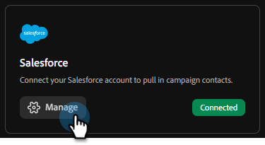

# Conectar con Salesforce {#salesforce}

Adobe Coworker Campaigns permite conectar su cuenta de Salesforce a...

>[!PREREQUISITES]
>
>Para utilizar este conector, primero debe tener:
>
>* Una cuenta activa de Salesforce
>* Los siguientes permisos en Salesforce: `api`, `sobjects.Contact.read`, `sobjects.Campaign.read`, `sobjects.CampaignMember.read`
>* Su URL de instancia de Salesforce, [ID de cliente y secreto de cliente](https://help.salesforce.com/s/articleView?id=xcloud.remoteaccess_oauth_client_credentials_flow.htm&type=5#:~:text=DESCRIPTION-,client_id,-The%20consumer%20key) son útiles

## Cómo conectar

1. En la página principal de [Campañas de colaboración](https://coworker-campaigns.experience.adobe.com/), haga clic en **Personalizar** y seleccione **Conectores**.

   

1. Haga clic en **Agregar integración**.

   

   >[!NOTE]
   >
   >Si esta no es su primera integración, el botón dirá &quot;Agregar conector&quot;.

1. En la fila Salesforce, haga clic en **Conectar**.

   

1. Escriba su **URL de instancia**, **ID de cliente** y **secreto de cliente** de Salesforce. Haga clic en **Conectar**.

   >[!NOTE]
   >
   >* En Salesforce, ID del cliente = Clave de consumidor y Secreto del cliente = Secreto del consumidor.
   >
   >* En la cuenta de Salesforce, puedes encontrar la URL de la instancia en la barra de direcciones del explorador o en **Configuración** > **Configuración de la empresa** > **Mi dominio**.

   

Después de la conexión, Salesforce aparece en la lista Conectores Y ¿QUÉ MÁS?

**Para desconectar:**

1. En la pantalla Conectores, busque el mosaico Salesforce y haga clic en **Administrar**.

   

1. Haga clic en **Desconectar** (no es necesario volver a escribir el secreto de cliente en este momento).

   

1. Vuelva a hacer clic en **Desconectar** para confirmar.

   
