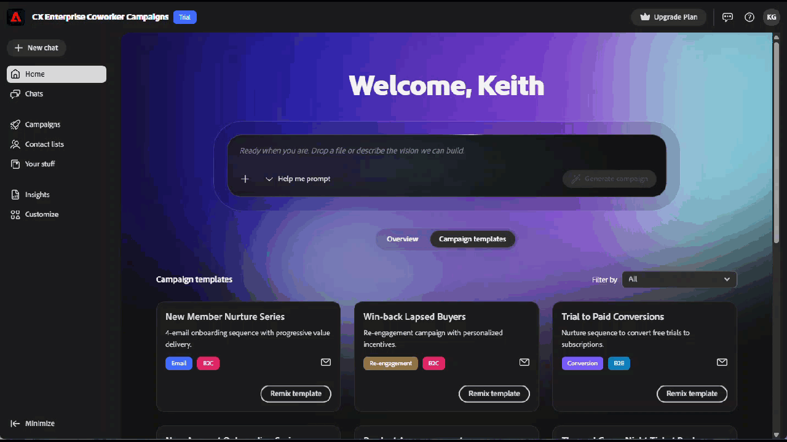

# Información general sobre Adobe Coworker Campaigns {#overview}

Campañas de compañeros es una aplicación de marketing nativa de IA que le lleva de un único mensaje a una campaña completa lista para revisión.

En este momento, todas las interacciones con la IA lo dirigirán hacia la [generación de campañas](./). Próximamente habrá más funcionalidades.

## Cómo acceder a

>[!NOTE]
>
>Campañas de Coworker está disponible a través de una prueba gratuita hasta el 1 de octubre de 2026. Durante la prueba, todos los activos y la actividad son específicos del usuario.

1. Vaya a coworker-campaigns.experience.adobe.com.

1. Si ya tienes una cuenta de Adobe, haz clic en **Iniciar sesión**. Si no lo hace, haga clic en **Únase a la versión de prueba gratuita** y cree una cuenta mediante el correo electrónico de su empresa.

   Los clientes de Adobe existentes se aprueban automáticamente y se dirigen directamente al entorno de prueba para aceptar los términos.

   Se solicita a los nuevos usuarios que creen una cuenta. El equipo de Campañas de compañeros revisa las solicitudes y aprueba los correos electrónicos comerciales. Recibirá un correo electrónico cuando se apruebe la solicitud.

1. Acepte los términos de prueba.

1. Configura tu marca en **Tus cosas** > **Marcas**. Campañas de coworker usa esta opción como predeterminada para todas las campañas que genere.

1. (Opcional) Cargue una plantilla de correo electrónico de HTML en **Plantillas de correo electrónico** para que Campañas de compañeros aplique su diseño al generar contenido.

   {width="800" zoomable="yes"}

Está listo para generar su primera campaña.

## Un recorrido por la interfaz

La interfaz Campañas de compañeros está organizada en torno a una navegación izquierda.

| Menú de navegación izquierdo | Objetivo |
|---|---|
| Nuevo chat | Inicie una nueva conversación para generar una campaña. |
| Inicio | Su punto de partida: barra de mensajes, campañas recientes y plantillas de campaña listas para usar. |
| Chats | Todas las conversaciones que ha iniciado y que aún no se han generado en un tablero de campañas. |
| Campañas | Su inventario de todas las campañas en borrador y en directo. |
| Tus cosas | Sus kits de marca y plantillas de correo electrónico (los recursos que utiliza Campañas de Coworker para mantener todo dentro de la marca). |
| Personalizar | Conectores (Marketo Engage en el inicio) y Habilidades (comportamientos personalizados que se pueden aplicar en todas las campañas). |

>[!NOTE]
>
>En el momento del lanzamiento, cada conversación en Campañas de Coworker se centra en generar una campaña. Las conversaciones de ideación, análisis y soporte se implementarán progresivamente.

## Qué puede hacer con Campañas de compañeros

Campañas de compañeros incorpora cinco flujos de trabajo que generalmente abarcan cinco herramientas diferentes en una experiencia conversacional:

- **Convierta un informe en un plan de campaña**. Envíe un mensaje o cargue un informe, y Campañas de compañeros devuelve un plan estructurado de extremo a extremo.
- **Crear y refinar audiencias**. Cargue un CSV o conecte los datos y, a continuación, refine el segmento en la conversación.
- **Generar contenido sin marca**. Campañas de compañeros escribe correos electrónicos que coinciden con la voz, las referencias y las plantillas de la marca.
- **Diseñar recorridos de varios pasos**. Campañas de Coworker ensambla secuencias de nutrición, no solo envíos únicos.
- **Enviar correos electrónicos de revisión**. Previsualice todos los mensajes de su bandeja de entrada antes del lanzamiento.
- **Iniciar y analizar**. _(Próximamente)_ Envíe campañas y obtenga información sobre los mejores pasos siguientes sin abandonar Campañas de compañeros de trabajo.

## Cómo funciona la IA

Coworker Campaigns sigue un bucle conversacional simple de varias vueltas:

**Entrada**. Proporcione un objetivo de campaña, la audiencia (cargada o conectada) y un contexto de marca opcional.

**Procesando**. La inteligencia artificial aplicada a la creación de campañas de compañeros genera un plan de campaña, crea un recorrido y redacta contenido personalizado. Todo lo cual puede hacer actualizaciones a, conversacionalmente.

**Salida**. Aparece un borrador de campaña en el tablero de campaña, listo para su revisión, iteración y posible lanzamiento.

Puede hablar con Campañas de compañeros en cualquier momento (por ejemplo, &quot;haga que el segundo correo electrónico sea más urgente&quot;, &quot;acorte las líneas de asunto&quot; o &quot;cambie la audiencia a clientes caducados del tercer trimestre&quot;) y actualizará los artefactos en su lugar.

>[!CAUTION]
>
>Compruebe siempre las salidas antes de enviarlas.

## Sugerencias para empezar

Algunas cosas que los primeros usuarios han encontrado que marcan una diferencia real:

- **Empiece con un caso de uso real específico**. &quot;Crear una serie de recuperación para clientes que no hayan hecho un pedido en 90 días&quot; es mejor que &quot;hacer una campaña&quot;. Consulte _Casos de uso_ para ver ejemplos específicos.
- **Limpia tus datos de audiencia**. Las campañas de compañeros solo pueden personalizarse, así como el CSV permite. Excluya a los contactos que no deba enviar por correo electrónico antes de cargar.
- **Invierte en la configuración de tu marca**. Campañas de compañeros extrae detalles de la marca al registrarse. Una rápida revisión de **Tus cosas** > **Marcas** beneficia a todas las campañas que generes.
- **Enviar un correo electrónico de revisión**. Antes de iniciar, envíe una prueba y revísela en su propia bandeja de entrada.
- **Iterar, no reiniciar**. Considere la primera salida de Campañas de compañeros como punto de partida. El camino más rápido hacia la grandiosidad son unas cuantas rondas de refinamiento, no una nueva petición.
- **Exporte cuando necesite un rastro de papel**. Exporte correos electrónicos individuales como HTML o la campaña completa como documento de Word o PDF para que los revise el equipo.
- **Clave de escape**. Pulse la tecla escape siempre que esté en un cuadro de diálogo o en el editor de Coworker de Campaign (campañas, recorrido, etc.) para salir rápidamente.

## Qué se debe saber sobre el juicio

Campañas de compañeros de trabajo es un producto en desarrollo activo. Esto es lo que hay que saber al entrar:

- **Ventana de prueba**: Desde ahora hasta el 1 de octubre de 2026.
- **Se requiere aceptación**: Tendrá que revisar y aceptar los términos de prueba antes de acceder al producto.
- **Región**: la versión de prueba gratuita solo está disponible para usuarios de Norteamérica en este momento.
- **Audiencias**: Las audiencias se cargan a través de CSV. Todas las audiencias son específicas para sus respectivas campañas (no se almacenan en ningún otro lugar del entorno en este momento).
- **Guía de datos**: no cargue datos confidenciales o regulados. Campañas de Coworker actualmente no está pensado para industrias reguladas por HIPAA.
- **Cumplimiento**: Usted es responsable de seguir las regulaciones de correo electrónico (cancelar la suscripción de vínculos, políticas de privacidad, etc.).
- **Límite de envíos**: (_Próximamente_) Cuando Launch esté disponible, puede enviar hasta 5000 correos electrónicos al mes.

## Vídeo introductorio

>[!VIDEO](https://video.tv.adobe.com/v/3492807?learn=on){transcript=true}

Las nuevas funciones se enviarán durante la versión de prueba. Los comentarios ayudan a determinar lo que viene después. Envíe comentarios a través del icono de comentarios del producto en el encabezado.
