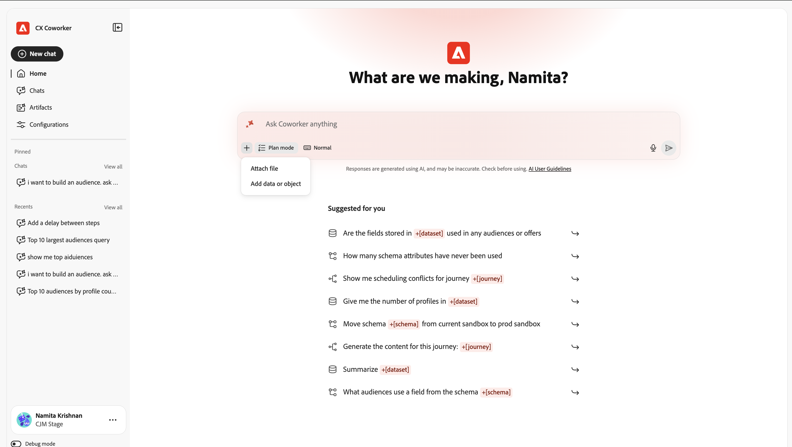
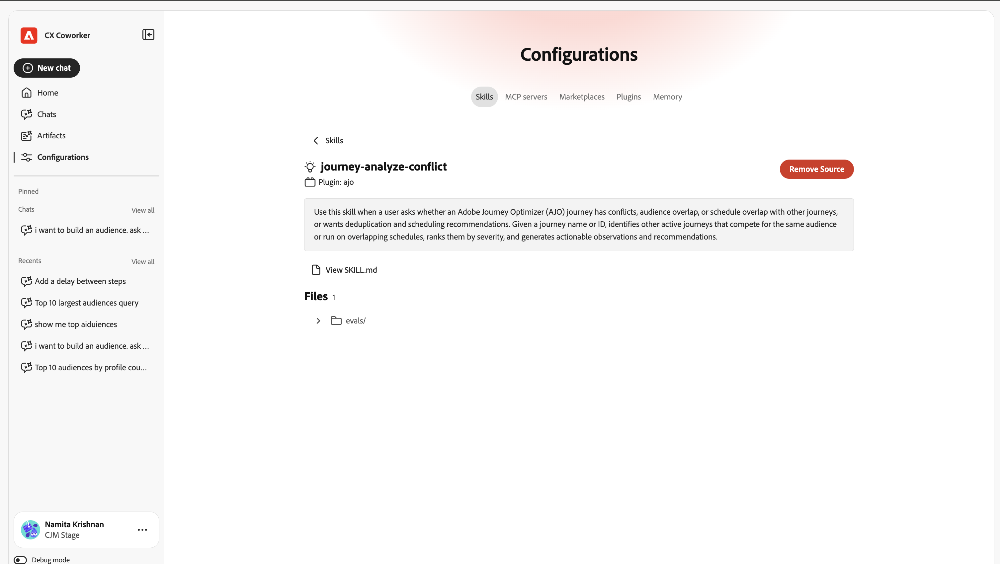
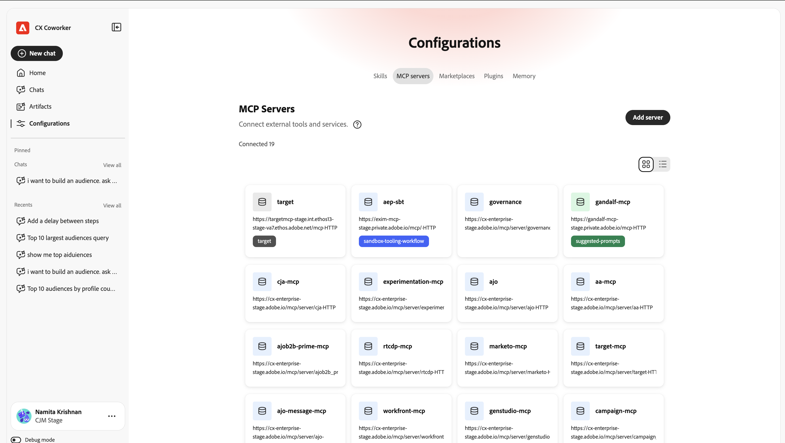

# Guía de IU {#ui-guide}

Obtenga orientación con la interfaz de Chat del compañero. Esta guía cubre todo, desde el acceso a la aplicación y la navegación por el espacio de trabajo hasta sacar el máximo partido a las conversaciones, administrar el historial y adaptar la configuración.

## Acceso a Coworker Chat

Para acceder a Chat de compañeros, navega a [https://experience.adobe.com/#/coworker](https://experience.adobe.com/#/coworker) e inicia sesión con tus credenciales de Adobe.

También puede acceder a él seleccionando **Compañero** del selector de aplicaciones en el encabezado superior de CX Enterprise.

## Elija su organización y zona protegida

El contexto actual se muestra en la parte inferior del carril de navegación izquierdo, debajo de su nombre y de la imagen de perfil. El contexto determina a qué datos, habilidades y herramientas conectadas puede llegar una conversación, por lo que debe confirmarlo antes de comenzar.

Seleccione su nombre para abrir el menú de cuenta, donde puede cambiar el contexto y la configuración del espacio de trabajo:

| Elemento de interfaz | Descripción |
| --- | --- |
| Tema | Ciclo del tema de la interfaz entre Luz y Oscuridad. |
| Configuración | Abra la configuración del espacio de trabajo para ver los detalles de su cuenta y otras opciones de configuración. |
| Selector de organización | Cambie frente a el que se ejecuta el Coworker de organización de IMS. |
| Selector de zona protegida | Cambie la zona protegida activa de AEP. |
| Aplicaciones CX | Vaya a otra aplicación de CX Enterprise conectada a su cuenta. |
| Cerrar sesión | Cierre la sesión de su cuenta de Adobe. |

## Navegación por la interfaz

La interfaz de CX Coworker tiene dos áreas principales: el carril de navegación a la izquierda y el lienzo de conversación que llena el resto de la ventana.

## El carril de navegación

El carril le permite acceder a todas las partes del producto y a su trabajo reciente.

| Elemento de interfaz | Descripción |
| --- | --- |
| Nuevo chat | Empieza una nueva conversación. El chat actual se guardará en el historial. |
| Inicio | Vuelva al saludo, cuadro de entrada y preguntas sugeridas. |
| Chats | Abre el historial de chat completo para buscar, fijar, archivar o eliminar conversaciones. |
| Configuraciones | Administre aptitudes, servidores MCP, mercados, complementos y memoria. |
| Anclado | Conversaciones que ha protagonizado, mantenidas en la parte superior para un acceso rápido. Seleccione Ver todo para verlos en la página de Chats. |
| Recientes | Sus conversaciones más recientes. Seleccione Ver todo para abrir la página Chats. |

## La pantalla Inicio

La pantalla Inicio es donde se inicia. Muestra un saludo personalizado, el cuadro de entrada y un conjunto de preguntas sugeridas extraídas de lo que Coworker Chat puede ayudarle a hacer en su zona protegida.

### Mensajes sugeridos

En Sugerido para usted, CX Coworker enumera tareas de ejemplo. Seleccione cualquier sugerencia para cargarla en el cuadro de entrada y, a continuación, edítela antes de enviarla o envíela tal cual. Las sugerencias son una forma rápida de ver los tipos de trabajo que admite Coworker Chat: mover esquemas entre zonas protegidas, buscar anomalías en un recorrido, validar un conjunto de datos y más.

### Menciones de entidad

Los mensajes sugeridos y los suyos propios pueden hacer referencia a objetos específicos de la zona protegida mediante menciones de entidad como +[schema], +[recorrido] y +[conjunto de datos]. Una mención de entidad indica a Coworker Chat a qué objeto se refiere exactamente, de modo que puede agregar sus propias menciones escribiendo **+**.

## El cuadro de entrada de chat

El cuadro de entrada (con la etiqueta &quot;Preguntar a un compañero sobre cualquier cosa&quot;) es donde se escribe. Debajo del campo de texto hay una barra de herramientas para archivos adjuntos, comportamiento de respuesta, entrada de voz y envío.

| Elemento de interfaz | Descripción |
| --- | --- |
| + (Adjuntar) | Abra el menú adjuntar para agregar un archivo o un objeto de datos al mensaje. |
| Modo Plan | Pida a Coworker Chat que proponga un plan paso a paso y que haga una pausa para su aprobación antes de que actúe. Desactívela para permitir que Coworker Chat actúe directamente. |
| Vista de transcripción | Controle la cantidad de actividad interna de Coworker Chat que se muestra: Normal, Enfoque o Detallada. |
| Micrófono | Dicte el mensaje con la entrada de voz. Seleccione de nuevo para detener la grabación. |
| Enviar | Envíe el mensaje. Mientras Coworker Chat está respondiendo, esto se convierte en un control Stop que puede utilizar para interrumpir. |

### Adjuntar archivos y datos

Seleccione + para adjuntar contexto al mensaje:

- Adjuntar archivo: Cargue un archivo que Coworker Chat pueda leer y mencionar en su respuesta.
- Agregar datos u objetos: haga referencia a un objeto de su zona protegida, como un conjunto de datos o un esquema, para que Coworker Chat funcione con los datos activos.

### Modo Plan

Active el modo de planificación cuando una tarea sea compleja o cambie datos y desee revisar primero el método. Coworker Chat responde con un plan y espera su aprobación antes de llevarlo a cabo. Cuando el modo de planificación está desactivado, Coworker Chat pasa directamente al trabajo.

### Vista de transcripción

La vista de transcripción establece qué parte del razonamiento y la actividad de la herramienta de Coworker Chat aparece en línea en la conversación:

| Elemento de interfaz | Descripción |
| --- | --- |
| Normal | Una vista equilibrada: se resumen los pasos clave de pensamiento y la actividad de la herramienta. |
| Focus | Una vista simplificada que oculta la mayoría de los pasos intermedios para que vea principalmente la respuesta. |
| Detallado | Todo el detalle: cada paso de reflexión, carga de aptitudes, lectura de archivos y consulta. |

## Trabajo con respuestas

Cuando envía un mensaje, Coworker Chat trabaja con la tarea abierta y, a continuación, devuelve su respuesta. Una respuesta puede incluir un razonamiento, un registro de las herramientas que ha utilizado y uno o más artefactos.

### Pensamiento y actividad

Mientras funciona, Coworker Chat muestra lo que está haciendo para que pueda seguir (y verificar) su proceso:

- Bloques de pensamiento: pasos contraíbles etiquetados como &quot;Pensado&quot; seguidos del número de segundos (o milisegundos). Expanda uno para leer el razonamiento de Coworker Chat.
- Actividad de aptitudes: las entradas como Cargado muestran las aptitudes que la capacidad especializada Chat de compañeros ha introducido para la tarea.
- Actividad de archivo y consulta: las entradas como Read file y Ran 1 query registran los archivos que Coworker Chat leyó y las consultas que ejecutó, cada una con el tiempo que tardó.

>[!TIP]
>
>Utilice la vista Transcripción detallada para ver cada paso o Enfoque para ocultarlos.

### Artefactos

Los resultados que produce Coworker Chat (como una tabla de audiencias) aparecen como tarjetas de artefactos dentro de la respuesta. Desde una tarjeta de artefactos puede descargar artefactos de tabla como archivo CSV. Cuando una respuesta incluya varios artefactos, utilice los controles de carrusel (Anterior / Siguiente y el recuento, por ejemplo 1 / 1) para moverse entre ellos.

### Leer el análisis

Debajo de sus artefactos, Coworker Chat resume lo que significan los resultados, destacando los hallazgos notables y sugiriendo acciones de seguimiento que puede tomar a continuación.

### Proporcionar comentarios y copiar respuestas

Cada respuesta tiene controles para clasificarla y reutilizarla:

- Pulgares hacia arriba / Pulgares hacia abajo: Valore la respuesta para ayudar a mejorar las respuestas futuras.
- Copiar: copie la respuesta mediante Copiar como Markdown (mantiene el formato) o Copiar como texto sin formato.

## Administrar los chats

Seleccione Chats en el carril de navegación para abrir todo su historial. Las conversaciones se agrupan por fecha y cada fila muestra el título del chat y cuántas vueltas contiene.

| Elemento de interfaz | Descripción |
| --- | --- |
| Buscar por título | Encuentra una conversación anterior por su nombre. |
| Mostrar anclado | Muestra solo las conversaciones que has protagonizado. |
| Mostrar archivados | Muestre las conversaciones que ha archivado. |
| Nuevo chat | Iniciar una nueva conversación. |
| Menú Fila (...) | En cualquier conversación, inicie (fije), cambie el nombre, archive o elimine. |

## Configuraciones

Configuraciones es donde puede adaptar lo que Coworker Chat puede hacer. Tiene cinco fichas: aptitudes, servidores MCP, mercados, complementos y memoria.

### Habilidades

Las habilidades son funcionalidades especializadas que Coworker Chat invoca automáticamente cuando son relevantes o que puede poner en déclencheur escribiendo / en el chat. La pestaña Aptitudes enumera todas las aptitudes instaladas y le permite añadir más.

- Añadir Source: instale aptitudes desde un nuevo origen.
- Buscar: encuentre una aptitud por su nombre.
- Cambiar vista: cambiar entre los diseños de cuadrícula y lista mediante el conmutador de vista.

Seleccione una habilidad para ver sus detalles: el complemento al que pertenece, una descripción de cuándo lo utiliza Chat del compañero y los archivos que incluye. Seleccione Ver aptitud.md para leer la definición completa de la aptitud o Quitar Source para desinstalarla.

### Servidores MCP

Los servidores MCP (Model Context Protocol) conectan Coworker Chat a herramientas y servicios externos, como Adobe Journey Optimizer, Real-Time CDP, Target y Workfront. La pestaña Servidores MCP enumera todo lo que está conectado actualmente y cuántas conexiones están activas.

- Agregar servidor: conecte una nueva herramienta o servicio externo.

Cada tarjeta muestra el nombre del servidor, su punto final y cualquier etiqueta que describa lo que proporciona.

### Marketplaces

Los Marketplaces son registros de complementos que puede examinar e instalar desde. La pestaña Marketplaces permite añadir registros y filtrarlos por grupo.

- Agregar Marketplace: registre un nuevo Marketplace de complementos.
- Buscar / Filtrar por grupo: restrinja la lista para encontrar un mercado.

Cada Marketplace muestra su origen y un estado Ready una vez que está disponible para la instalación desde.

### Complementos

Los complementos amplían el chat de Coworker con habilidades agrupadas y servidores MCP que se instalan y administran juntos como una unidad. La pestaña Plugins muestra lo que está instalado y le permite añadir más desde sus marketplaces.

- Buscar nuevos plugins para instalar.
- Desinstalar: elimine un complemento instalado y todo lo que incluye.
- Filtrar por mercado: ver qué complementos provienen de qué registro.

### Memoria

La memoria permite que Coworker Chat recuerde sus preferencias a través de las conversaciones para que sus respuestas sean relevantes y personales a lo largo del tiempo.

- Habilitar memoria: active o desactive la memoria entre sesiones.
- Preferencias almacenadas: las preferencias de Chat del compañero ha aprendido y guardado. Cada entrada puede editarse, eliminarse o inspeccionarse, y las entradas pueden filtrarse por categoría.
- Historial de recuerdos guardados: una cronología de los cambios en los recuerdos almacenados.

