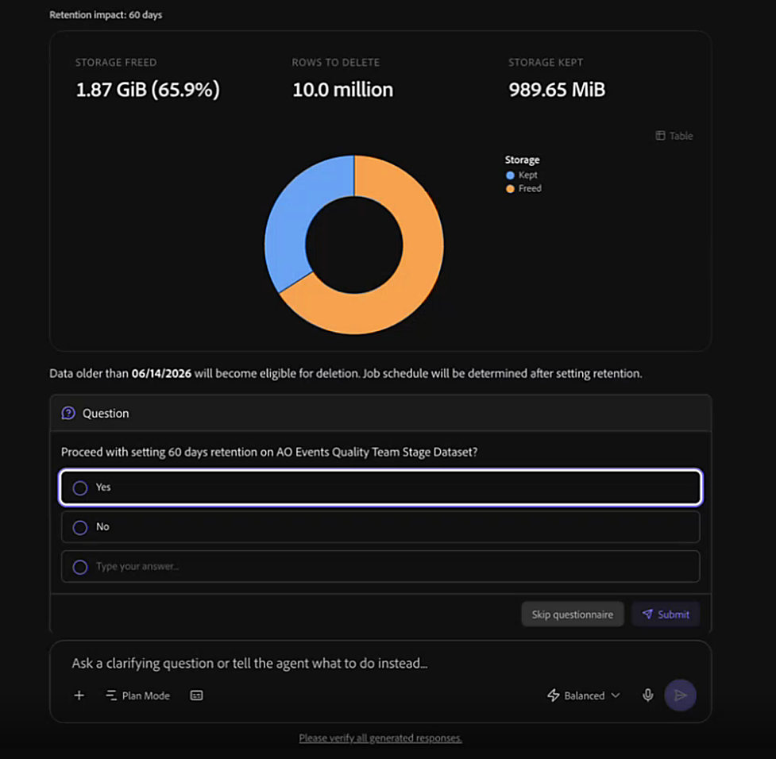
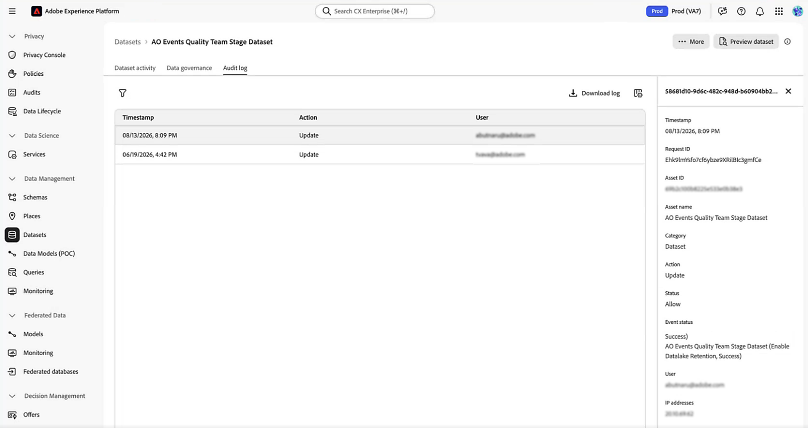

# Administrar la retención del lago de datos

Utilice CX Coworker para comprender el valor de los datos de evento de experiencia en su zona protegida e identificar los datos que pueden beneficiarse de la optimización. Puede comenzar con una solicitud amplia, como pedir a su compañero que optimice los datos de su zona protegida o que limpie los conjuntos de datos. El colaborador utiliza el agente de administración de datos para mostrar conjuntos de datos que merecen la pena investigar, analizar cómo se utiliza un conjunto de datos, modelar el impacto de un período de retención y, cuando corresponda, ayudarle a administrar su política de retención del lago de datos.

## Antes de empezar {#before-you-begin}

Asegúrese de estar trabajando en el entorno limitado que contiene los conjuntos de datos que desea revisar. También necesita acceder al agente de gestión de datos y a los permisos de Adobe Experience Platform necesarios. Ver [Requisitos previos del agente de administración de datos](../../../../agents/data-management.md#prerequisites).

## Optimización de datos en la zona protegida {#optimize-data-in-your-sandbox}

Utilice estas habilidades juntas como un flujo de trabajo. Comience con un objetivo amplio de administración de datos, como comprender el valor de los datos u optimizar los datos de la zona protegida. El colaborador le ayuda a encontrar conjuntos de datos que vale la pena investigar, comprobar cómo se utiliza un conjunto de datos, modelar el impacto de un posible período de retención y, a continuación, establecer, cambiar o quitar una directiva de retención una vez que esté listo para actuar.

### Buscar datos que merecen ser optimizados {#find-data-worth-optimizing}

Para decidir por dónde empezar, pida a sus compañeros que identifiquen conjuntos de datos de Experience Event que merezcan la pena investigar. Puede empezar preguntando sobre el valor de los datos, la optimización de los datos o la limpieza del conjunto de datos. Utilice la aptitud Enumerar conjuntos de datos para revisar el tamaño de almacenamiento, el recuento de filas, el estado de retención existente y la habilitación del perfil. Puede filtrar los resultados por criterios como el tamaño del conjunto de datos, el recuento de filas o el acceso reciente para reducir la lista. La aptitud es de solo lectura. Compañero de trabajo devuelve una tabla que puede analizar y comparar, junto con visualizaciones que resaltan conjuntos de datos por tamaño, recuento de filas y edad de los datos.

Una vez que haya reducido la lista, utilice la habilidad Analizar uso del conjunto de datos para averiguar cómo se utiliza activamente un conjunto de datos específico.

No todos los conjuntos de datos no utilizados o abandonados que aparecen con esta aptitud son buenos candidatos para una política de retención de lago de datos. Si necesita quitar un conjunto de datos completo o administrar datos en otro almacén de Experience Platform, vea [Elegir la capacidad de administración del ciclo de vida de datos correcta](https://experienceleague.adobe.com/en/docs/experience-platform/data-lifecycle/choose-a-capability). Antes de establecer una política de retención de lago de datos, confirme que el conjunto de datos es un conjunto de datos de evento de experiencia.

Ejemplos de peticiones de datos:

- &quot;Tengo la sensación de que mis datos se pueden optimizar&quot;.
- &quot;Ayúdeme a comprender el valor de mis datos&quot;.
- &quot;Optimizar los datos de mi zona protegida&quot;.
- &quot;Limpiar los conjuntos de datos de mi zona protegida&quot;.
- &quot;Mostrarme los conjuntos de datos de eventos más grandes&quot;.
- &quot;Mostrarme conjuntos de datos de más de 100 GB que no tengan establecida la retención del lago de datos&quot;.
- &quot;Necesito eliminar unos 2 TB de datos. ¿Por dónde debería empezar?&quot;
- &quot;¿Puede ayudarme a encontrar datos huérfanos, abandonados o sin utilizar?&quot;
- &quot;Priorice los conjuntos de datos a los que no se ha accedido en los últimos 90 días&quot;.

### Compruebe cómo se utiliza activamente un conjunto de datos {#check-how-actively-a-dataset-is-used}

Antes de decidir si un conjunto de datos es un buen candidato para una política de retención de lago de datos, descubra cómo se utiliza activamente el conjunto de datos. Utilice la habilidad Analizar el uso del conjunto de datos para evaluar un conjunto de datos específico en varias señales de uso. Estas señales incluyen la actividad de ingesta reciente, la actividad de consulta, la estabilidad del esquema y si el conjunto de datos alimenta otras aplicaciones de Adobe Experience Platform. La aptitud es de solo lectura. El compañero devuelve un nivel de uso general, un desglose de las señales y un resumen en lenguaje sencillo de lo que indican sobre el conjunto de datos.

<!-- TODO: Confirm the final usage-tier thresholds with engineering after the planned update from a 7-day to a 30-day analysis window is complete. Update this section with the final definitions before publishing. -->

>[!NOTE]
>
>Las métricas mostradas tienen la intención de proporcionar señales útiles y es posible que no representen todos los factores relevantes para su decisión. Recomendamos revisar los detalles disponibles y aplicar el contexto empresarial antes de tomar medidas.

Ejemplos de peticiones de datos:

- &quot;¿De qué forma se utiliza mi conjunto de datos de eventos web?&quot;

### Modelar el impacto de un período de retención {#model-the-impact-of-a-retention-period}

Antes de comprometerse con un período de retención específico, descubra cuántos datos se guardarán o eliminarán. Utilice la habilidad Analizar retención de conjuntos de datos para revisar las métricas de almacenamiento de un conjunto de datos y la distribución de edad de sus datos. A continuación, utiliza esa distribución para modelar la cantidad de datos que conservaría o eliminaría un período de retención propuesto. El compañero muestra el impacto estimado por recuento de filas y tamaño de almacenamiento.

La aptitud es de solo lectura. El compañero devuelve la edad de los datos y el análisis de impacto directamente en la conversación, por lo que puede comparar los resultados con la configuración de retención actual del conjunto de datos antes de decidir si desea cambiarlos.

Ejemplos de peticiones de datos:

- &quot;¿Cuál sería el impacto si configuro un periodo de retención de 60 días en este conjunto de datos?&quot;

### Establecer, cambiar o quitar una directiva de retención {#set-change-or-remove-a-retention-policy}

>[!IMPORTANT]
>
>El período mínimo de retención del lago de datos es de 30 días. No se admiten periodos más cortos.

Una vez que haya decidido un período de retención, utilice la habilidad Administrar retención de conjuntos de datos para establecer, cambiar o quitar una política de retención de lago de datos en un conjunto de datos. La aptitud muestra el impacto propuesto antes de aplicar cualquier cambio. La directiva solo se aplica después de aprobar explícitamente la solicitud. La descripción del cambio que desea no lo aplica.

Después de confirmar una política de retención, el cambio puede tardar un poco en aparecer en la interfaz de usuario de Adobe Experience Platform. La política de retención no elimina inmediatamente los datos caducados. El trabajo de retención inicial se inicia dentro de las 24 horas siguientes a la aplicación de la directiva. Después de la ejecución inicial, un trabajo programado evalúa y elimina los registros caducados cada 30 días. Consulte la guía de retención de conjuntos de datos (TTL) de [Experience Event](https://experienceleague.adobe.com/en/docs/experience-platform/catalog/datasets/experience-event-dataset-retention-ttl-guide) para obtener más información sobre la retención y la depuración.

Cada cambio de la política de retención se registra en una pista de auditoría, incluso cuando se establece, cambia o elimina una política. La pista de auditoría registra quién realizó cada cambio, cuándo se produjo y qué se modificó. Puede seguir el vínculo proporcionado por el colaborador para revisar estos eventos en la pestaña Registro de auditoría del conjunto de datos en Adobe Experience Platform. Para obtener más información, consulte [Resumen de registros de auditoría](https://experienceleague.adobe.com/es/docs/experience-platform/landing/governance-privacy-security/audit-logs/overview).

Ejemplos de peticiones de datos:

- &quot;Establezca la retención en este conjunto de datos en 60 días&quot;.
- &quot;Quitar la política de retención de este conjunto de datos&quot;.

## Prácticas recomendadas {#best-practices}

Tenga en cuenta las siguientes prácticas al utilizar el agente de gestión de datos:

- **Empieza con una meta amplia.** Si no sabe qué conjunto de datos necesita atención, pídale a su compañero que le ayude a comprender el valor de sus datos o a optimizar los datos de su zona protegida. Utilice la aptitud Conjuntos de datos de lista para identificar conjuntos de datos con señales que sugieran un uso bajo o ningún uso reciente antes de analizar un conjunto de datos individual.
- **Revise la vista previa de impacto antes de confirmar.** Revise lo que se conservaría y eliminaría antes de aprobar un cambio de retención.
- **Espere tiempo para que aparezcan los cambios.** Después de confirmar un cambio de retención en CX Coworker, espere un poco para que la interfaz de usuario de Adobe Experience Platform refleje el cambio.

## Próximos pasos {#next-steps}

Para obtener más información sobre las habilidades, el ámbito, el comportamiento y las limitaciones del agente de administración de datos, consulte la [descripción general del agente de administración de datos](../../../../agents/data-management.md). Para obtener más información sobre cómo funcionan las políticas de retención del lago de datos en Adobe Experience Platform, consulte la [guía de retención de conjuntos de datos de eventos de experiencia (TTL)](https://experienceleague.adobe.com/en/docs/experience-platform/catalog/datasets/experience-event-dataset-retention-ttl-guide).
