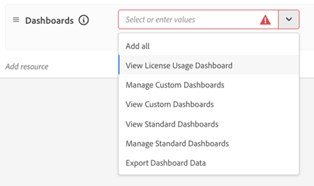

# Paneles de monitorización de IA automática

El tablero de [!UICONTROL Supervisión] de inteligencia artificial aplicada a la agencia proporciona a los miembros del Centro de excelencia (COE) y a otras partes interesadas en la gobernanza visibilidad sobre el uso y la adopción de IA auténtica. Vea las tendencias de 7 días o 30 días para ver quién usa [!DNL AI Assistant] u otras superficies (como [Adobe Marketing Agent for Microsoft 365 Copilot](https://experienceleague.adobe.com/es/docs/cx-enterprise-ai/experience-cloud-ai/agents/ama-ms)) para interactuar con [!DNL Experience Platform Agents] y el valor que reciben. En conjunto, estas vistas le ayudan a guiar la adopción de agentes con datos en lugar de suposiciones.

**Disponibilidad**

* En este momento, cualquier cuenta con una licencia para al menos una aplicación nativa de Experience Platform (Customer Journey Analytics, Journey Optimizer o Real-Time CDP) puede acceder a este panel
* Las métricas de uso y adopción de [aplicaciones con prioridad de IA](agentic-ai.md#ai-first-cx-enterprise-applications) como Experimentation Accelerator, LLM Optimizer y Sites Optimizer no se encuentran en el ámbito de este tablero.

El panel [!UICONTROL Supervisión] incluye las siguientes vistas:

| Panel de control | Objetivo |
| --- | --- |
| **Información general** | Métricas agregadas entre usuarios, conversaciones, comentarios y consumo de crédito |
| **Usuarios** | Frecuencia de uso, distribución y participación del usuario |
| **Comentarios** | Señales sobre calidad de respuesta y satisfacción del usuario |
| **Créditos de IA** | Tendencias del consumo de crédito y saldo restante |

En la documentación de [Inteligencia artificial aplicada a la agencia en Adobe CX Enterprise](agentic-ai.md) se enumeran los agentes con ámbito para la supervisión del uso en la tabla [agentes de inteligencia artificial aplicada en aplicaciones CX Enterprise existentes](agentic-ai.md#existing-apps-table).

>[!VIDEO](https://video.tv.adobe.com/v/3491871?captions=spa&learn=on)

## Habilitar permisos de tablero {#permissions}

Conceda acceso al panel en [!DNL Adobe Experience Platform] al actualizar el perfil de producto o la función para cada usuario autorizado. La característica [!UICONTROL Supervisión] se muestra a los usuarios en la página de inicio de CX Enterprise después de habilitar los permisos.

>[!IMPORTANT]
>
>Los datos de monitorización solo están disponibles en la zona protegida de producción predeterminada. Los entornos limitados de desarrollo no son compatibles con la visualización de datos de monitorización. Los usuarios deben tener los permisos de monitorización necesarios para la zona protegida de producción predeterminada y cambiar a esa zona protegida para ver los datos de monitorización.
>
>Para evitar confusiones, Adobe recomienda conceder permisos de monitorización en todas las zonas protegidas, incluida la zona protegida de producción predeterminada. Esto ayuda a garantizar que los usuarios puedan acceder al panel de monitorización independientemente de la zona protegida seleccionada actualmente y reduce la probabilidad de confundir una zona protegida no compatible con un panel vacío o no funcional.

**Para habilitar los permisos del tablero**

1. Vaya a [!DNL Experience Platform] **Administración** > **Permisos**.

1. Abra el perfil de producto o la función que desee actualizar.

   

1. En los permisos de **[!UICONTROL Asistente de IA]**, haga clic en **[!UICONTROL Agregar recurso]** y, a continuación, habilite **[!UICONTROL Ver tablero de uso del Asistente de IA]**.

   Este permiso concede acceso a los paneles de monitorización de uso de inteligencia artificial aplicada a la agencia.

1. En **[!UICONTROL Permisos de paneles]**, configure el acceso a los paneles en función de las responsabilidades de cada usuario.

   

   Permisos recomendados para usuarios de gobernanza autorizados:

   * **[!UICONTROL Ver tablero de uso de licencias]**
   * **[!UICONTROL Ver paneles estándar]**
   * **[!UICONTROL Exportar datos de panel]** (opcional; solo para usuarios de administración aprobados)

   Permisos adicionales que puede conceder cuando sea necesario:

   * **[!UICONTROL Administrar paneles personalizados]**
   * **[!UICONTROL Ver paneles personalizados]**
   * **[!UICONTROL Administrar paneles estándar]**

1. Para ver los paneles, vuelva al inicio de CX Enterprise y haga clic en **[!UICONTROL Supervisión]**.

   

## Panel de información general

El panel Información general es el lugar central para las métricas de adopción y participación en toda la organización. Conecta las tendencias de alto nivel con un análisis más profundo. Para ver los factores que influyen en las métricas, revise las conversaciones individuales de cualquier métrica.

### Métricas en el tablero Información general

* **Indicadores a lo largo del tiempo:** Tendencias generales de crecimiento y adopción de uso.
* **Usuarios activos y conversaciones:** Cantidad de usuarios que interactúan con [!DNL Experience Platform Agents].
* **Promedio de mensajes por conversación:** Profundidad de participación por conversación.
* **Comentarios:** Distribución de comentarios de usuarios con miniaturas hacia arriba y miniaturas hacia abajo (solo para [!DNL AI Assistant] interacciones).

>[!VIDEO](https://video.tv.adobe.com/v/3491881?captions=spa&learn=on)

### Reproducción de conversación

La reproducción de la conversación muestra interacciones individuales, no solo acumulaciones. Puede analizar los patrones en muchas conversaciones y pasar de tendencias de alto nivel a una conversación específica.

* **Historial de mensajes y respuestas:** El mensaje del usuario y las respuestas entregadas.
* **Señales de comentarios:** Interacciones que los usuarios marcaron con los pulgares hacia arriba o hacia abajo para identificar fricciones, bloqueadores o necesidades de habilitación. Esta información ayuda a su organización a mejorar la relevancia rápida y ayuda a Adobe a mejorar la calidad de la respuesta con el paso del tiempo.

>[!VIDEO](https://video.tv.adobe.com/v/3491890?captions=spa&learn=on)

## Panel de usuarios

El panel Usuarios muestra cómo la adopción y la participación de los agentes varían entre los usuarios a lo largo del tiempo. Se puede ver quién usa activamente [!DNL Experience Platform Agents], qué superficie usa y con qué frecuencia interactúa. Los administradores y los miembros del COE pueden explorar en profundidad la actividad y las conversaciones de cada usuario para comprender los patrones de participación y el comportamiento de uso.

### Métricas en el panel de usuarios

* **Tendencias de adopción y participación con el paso del tiempo:** Rastree cómo cambian los segmentos de usuario durante el período seleccionado. Los usuarios se clasifican como:
  * **Nuevo:** Primera actividad en el período seleccionado, sin actividad durante los 12 meses anteriores.
  * **Repetir:** Actividad tanto en el período seleccionado como en el período anterior.
  * **Devolver:** Actividad en el período seleccionado, pero no en el período anterior.
  * **Inactiva:** No hay actividad en el período seleccionado, sino actividad en el período anterior.
* **Patrones de participación del usuario:** La frecuencia con la que los usuarios interactúan con los agentes y cómo cambia la participación con el paso del tiempo.
* **Actividad de conversación:** Número de conversaciones y mensajes por usuario.
* **Usuarios activos principales:** Usuarios y equipos altamente comprometidos que impulsan la adopción de agentes.

>[!VIDEO](https://video.tv.adobe.com/v/3491923?captions=spa&learn=on)

## Tablero de comentarios

El panel de comentarios muestra los comentarios del usuario enviados para las interacciones del agente. Puede ver qué conversaciones marcaron positiva o negativamente los usuarios e investigar las interacciones detrás de los comentarios. Para revisar los mensajes, las respuestas, los detalles de razonamiento y las notas de comentarios, explore en profundidad las conversaciones individuales a partir de los resúmenes de comentarios.

### Métricas en el panel de comentarios

* **Los comentarios cambian con el tiempo:** Cómo cambian los comentarios de los usuarios con el paso del tiempo.
* **Pulgares arriba y pulgares abajo comentarios:** Señales de interacción positivas y negativas.
* **Categorías de comentarios:** Motivo detrás de cada pulgar hacia arriba y hacia abajo.
* **Historial de mensajes y respuestas:** Mensajes de usuario y respuestas asociadas con los comentarios enviados.
* **Notas y detalles de comentarios:** Contexto y comentarios adicionales de los usuarios durante el envío de comentarios.

>[!VIDEO](https://video.tv.adobe.com/v/3491914?captions=spa&learn=on)

## Panel de créditos de IA

El panel Créditos de IA muestra cómo el uso de [!DNL Experience Platform Agents] por parte de su organización se traduce en consumo de créditos de IA.

### Métricas en el panel Créditos de IA

* **Créditos de IA totales consumidos:** Uso general del agente en créditos de IA.
* **Tendencias diarias y mensuales:** picos, caídas y cambios en los patrones de consumo.
* **Créditos de inteligencia artificial restantes:** Saldo restante para que pueda planificar de forma proactiva y evitar cargos adicionales.

>[!VIDEO](https://video.tv.adobe.com/v/3491905?captions=spa&learn=on)

## Más ayuda sobre este tema

* [Panel de uso de licencias](https://experienceleague.adobe.com/es/docs/experience-platform/dashboards/guides/license-usage) en [!DNL Experience Platform]
* [Inteligencia artificial aplicada a la agencia en Adobe CX Enterprise](agentic-ai.md)
* [Trabajos del agente y consumo de crédito de IA](ai-credit-consumption.md)
* [Panel de uso de licencias](https://experienceleague.adobe.com/es/docs/experience-platform/dashboards/guides/license-usage) (Experience Platform)
